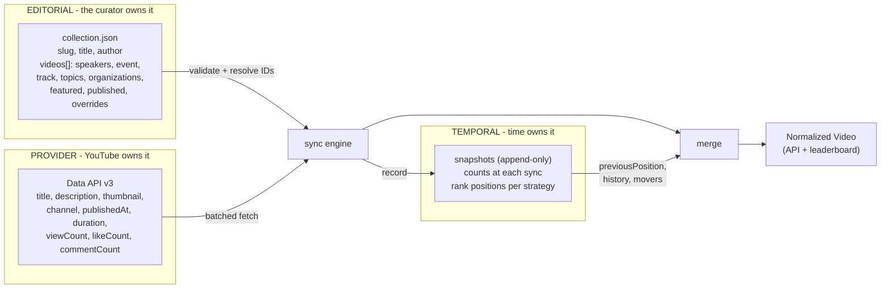
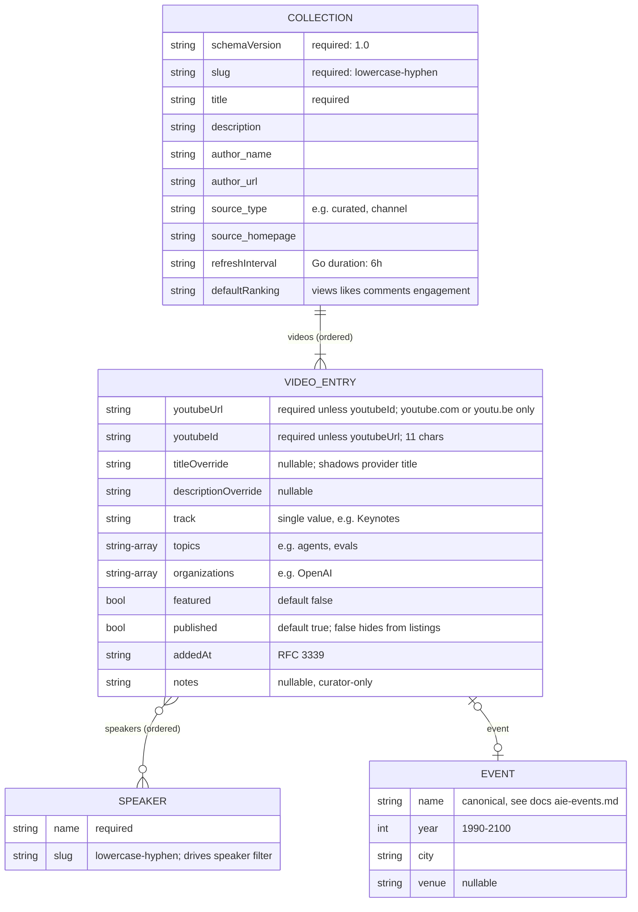
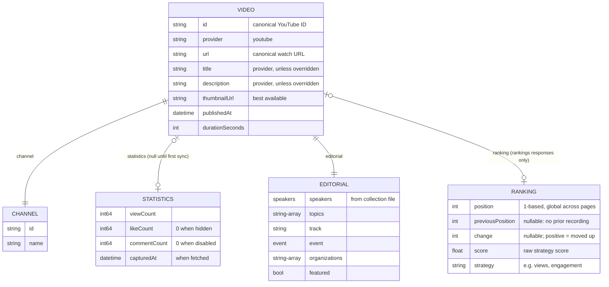
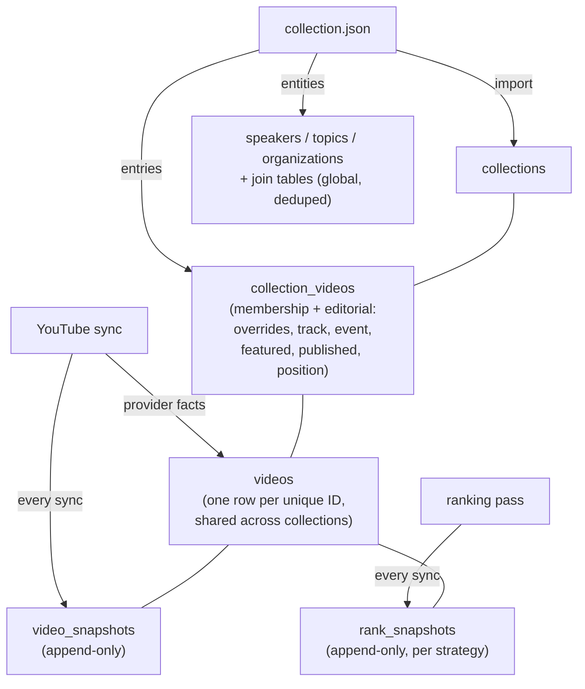

# Metadata Format

How Discovery Engine's metadata is layered, who owns each layer, and how
the layers merge into the normalized API model. Companion to
`openapi/collection.schema.json` (input contract) and
`openapi/openapi.yaml` (output contract).

## The three layers

One video's metadata comes from three sources with three different
owners and lifetimes. The engine never mixes ownership: editors cannot
change view counts, YouTube cannot change topics.

Facts about the split:

- Editorial facts live only in the collection file. YouTube has no event
  field (verified empirically: 5 of 919 channel videos carry any event
  text), so `event`, `track`, `topics` can only be curated.
- Provider facts are never hand-edited; they refresh on every sync.
  `titleOverride`/`descriptionOverride` are the only editorial fields
  that shadow provider facts, and only when non-empty.
- Temporal facts are append-only. File mode keeps just the previous run
  (enough for movement arrows); database mode keeps the full series
  (enabling views_24h, growth, movers).

## Input: the collection file schema (v1.0)

## Output: the normalized Video (API + web)

## Database mode: where each layer lands

Key property: a video in N collections has one `videos` row and one
snapshot history, but N membership rows each carrying that collection's
editorial metadata. Curated collections split off from the channel pool
inherit history for free; editorial context stays per-collection.
Exception to per-collection editorial: speakers/topics/organizations are
global joins per the PRD table list (last import wins; tradeoff recorded
in db-schema.md).
