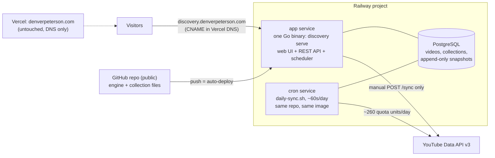
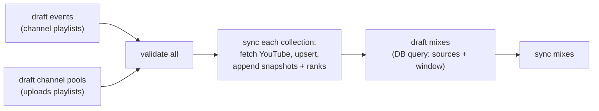

# System Architecture

Denver's one-line version is correct and worth protecting: **a Go app on
a server, a Postgres database, and a daily cron. Maybe a future agent.**
Everything below is detail inside those four boxes; resist adding a
fifth. Companion docs: adr-001 (contracts/modes), metadata-format.md
(data model), db-schema.md (storage).

## Topology (target: Railway + Vercel DNS)

## The four boxes

**1. The Go app** — one binary (`discovery serve`), one process. Serves
the server-rendered leaderboard at `/`, the REST API under `/api/v1`,
and `/health`. Stateless between requests in db mode: every page reads
Postgres live, so data refreshes need no restart; only code changes do.
No JS framework, no frontend build, no sidecar. The same binary is the
CLI (`validate/sync/import/export`).

**2. The database** — Postgres, the only stateful component. Current
facts (videos, membership, editorial) plus two append-only time series
(metric snapshots, rank snapshots). ~7.4k videos today; a year of daily
syncs adds ~2.7M snapshot rows — nothing Postgres notices. File mode
(no DB) remains supported for self-hosters; production runs db mode.

**3. The cron** — `scripts/daily-sync.sh`, the whole editorial pipeline
in one idempotent run:

Collection files are the interface between cron and app: the cron
regenerates and syncs them; the app just serves what the DB holds. Rank
movement, trending, and movers all derive from this cadence — arrows
mean "since the previous run."

**4. The repo** — GitHub is the deploy pipeline (push to main =
auto-deploy) and the admin surface (collection files are curation,
versioned and diffable; FE-4 decision: no login until multi-tenant).
Secrets live only in Railway variables: `YOUTUBE_API_KEY`,
`DISCOVERY_DATABASE_URL` (mapped explicitly from Railway's Postgres —
the app ignores plain `DATABASE_URL` by design).

## Request and sync paths

- Read path: browser/API → Go app → service layer (filters, pagination,
  ranking assembly) → store (Postgres) → response. No caches; Postgres
  at this scale is the cache.
- Sync path (one code path, three triggers): cron daily, CLI manually,
  `POST /api/v1/sync` (cooldown-limited; gets a bearer-token guard
  before public deploy — FE-4 stage 2).

## Deliberately absent

No queue, no Redis, no microservices, no CDN, no auth system, no
Kubernetes. A single ~$5/month service handles this comfortably at
100x current traffic; the leaderboard is server-rendered HTML measured
in tens of KB. The architecture's job is to stay boring so the
editorial layer can be the product.

## The future agent (the fifth box, when it earns its place)

Today's drafters are deterministic scripts: playlists in, JSON out. The
agent slot is the judgment layer on top — same interface (writes
collection files, opens PRs), which is why the architecture doesn't
change to accommodate it:

- Proposes curated collections from the pools ("WF26 keynotes worth
  watching") with speaker/topic/track enrichment beyond title parsing.
- Reviews drafts visually via the leaderboard (the attribution bug
  proved rendered pages catch what JSON review misses).
- Watches trending data and flags anomalies worth a human look.
- Ships as PRs against collection files — Denver stays the merge
  authority, git stays the audit log, FE-4's no-login stance holds.

The invariant to defend: the agent curates through the same file
interface humans use. If it ever needs its own tables or write API,
that's a design smell, not a requirement.
